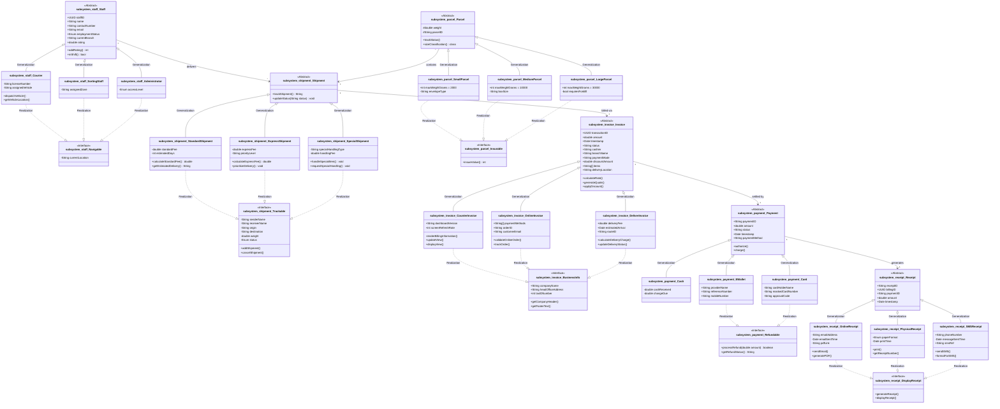

```mermaid
classDiagram
    %% ==========================================
    %% 1. STAFF & PERSONNEL SUBSYSTEM
    %% ==========================================
    subsystem_staff_Staff <|-- subsystem_staff_Courier : Generalization
    subsystem_staff_Staff <|-- subsystem_staff_SortingStaff : Generalization
    subsystem_staff_Staff <|-- subsystem_staff_Administrator : Generalization
    subsystem_staff_Courier ..|> subsystem_staff_Navigable : Realization
    subsystem_staff_SortingStaff ..|> subsystem_staff_Navigable : Realization
    subsystem_staff_Administrator ..|> subsystem_staff_Navigable : Realization

    %% ==========================================
    %% 2. CONSIGNMENT TRANSIT SUBSYSTEM (SHIPMENT)
    %% ==========================================
    subsystem_shipment_Shipment <|-- subsystem_shipment_StandardShipment : Generalization
    subsystem_shipment_Shipment <|-- subsystem_shipment_ExpressShipment : Generalization
    subsystem_shipment_Shipment <|-- subsystem_shipment_SpecialShipment : Generalization
    subsystem_shipment_StandardShipment ..|> subsystem_shipment_Trackable : Realization
    subsystem_shipment_ExpressShipment ..|> subsystem_shipment_Trackable : Realization
    subsystem_shipment_SpecialShipment ..|> subsystem_shipment_Trackable : Realization

    %% ==========================================
    %% 3. PHYSICAL CARGO SUBSYSTEM (PARCEL)
    %% ==========================================
    subsystem_parcel_Parcel <|-- subsystem_parcel_SmallParcel : Generalization
    subsystem_parcel_Parcel <|-- subsystem_parcel_MediumParcel : Generalization
    subsystem_parcel_Parcel <|-- subsystem_parcel_LargeParcel : Generalization
    subsystem_parcel_SmallParcel ..|> subsystem_parcel_Insurable : Realization
    subsystem_parcel_MediumParcel ..|> subsystem_parcel_Insurable : Realization
    subsystem_parcel_LargeParcel ..|> subsystem_parcel_Insurable : Realization

    %% ==========================================
    %% 4. FINANCIAL AUDITING SUBSYSTEM (INVOICE)
    %% ==========================================
    subsystem_invoice_Invoice <|-- subsystem_invoice_CounterInvoice : Generalization
    subsystem_invoice_Invoice <|-- subsystem_invoice_OnlineInvoice : Generalization
    subsystem_invoice_Invoice <|-- subsystem_invoice_DeliverInvoice : Generalization
    subsystem_invoice_CounterInvoice ..|> subsystem_invoice_BusinessInfo : Realization
    subsystem_invoice_OnlineInvoice ..|> subsystem_invoice_BusinessInfo : Realization
    subsystem_invoice_DeliverInvoice ..|> subsystem_invoice_BusinessInfo : Realization

    %% ==========================================
    %% 5. PAYMENT GATEWAY SUBSYSTEM
    %% ==========================================
    subsystem_payment_Payment <|-- subsystem_payment_Cash : Generalization
    subsystem_payment_Payment <|-- subsystem_payment_EWallet : Generalization
    subsystem_payment_Payment <|-- subsystem_payment_Card : Generalization
    subsystem_payment_EWallet ..|> subsystem_payment_Refundable : Realization
    subsystem_payment_Card ..|> subsystem_payment_Refundable : Realization

    %% ==========================================
    %% 6. PROOF OF PURCHASE SUBSYSTEM (RECEIPT)
    %% ==========================================
    subsystem_receipt_Receipt <|-- subsystem_receipt_OnlineReceipt : Generalization
    subsystem_receipt_Receipt <|-- subsystem_receipt_PhysicalReceipt : Generalization
    subsystem_receipt_Receipt <|-- subsystem_receipt_SMSReceipt : Generalization
    subsystem_receipt_OnlineReceipt ..|> subsystem_receipt_DisplayReceipt : Realization
    subsystem_receipt_PhysicalReceipt ..|> subsystem_receipt_DisplayReceipt : Realization
    subsystem_receipt_SMSReceipt ..|> subsystem_receipt_DisplayReceipt : Realization

    %% ==========================================
    %% CROSS-DOMAIN SYSTEMS ASSOCIATIONS (DATA FLOW)
    %% ==========================================
    subsystem_staff_Staff "1" --> "*" subsystem_shipment_Shipment : delivers
    subsystem_parcel_Parcel "*" --> "1" subsystem_shipment_Shipment : contains
    subsystem_shipment_Shipment "1" --> "1" subsystem_invoice_Invoice : billed via
    subsystem_invoice_Invoice "1" --> "1" subsystem_payment_Payment : settled by
    subsystem_payment_Payment "1" --> "1" subsystem_receipt_Receipt : generates

    %% ==========================================
    %% PACKAGES DEFINITIONS & ATTRIBUTES
    %% ==========================================
    %% 1. Staff Subsystem
    class subsystem_staff_Staff {
        <<Abstract>>
        +UUID staffID
        +String name
        +String contactNumber
        +String email
        +Enum employmentStatus
        +String currentBranch
        +double rating
        +addRating() int
        +inShift() bool
    }
    class subsystem_staff_Courier {
        -String licenseNumber
        -String assignedVehicle
        +dispatchVehicle()
        +getVehicleLocation()
    }
    class subsystem_staff_SortingStaff {
        -String assignedZone
    }
    class subsystem_staff_Administrator {
        -Enum accessLevel
    }
    class subsystem_staff_Navigable {
        <<Interface>>
        -String currentLocation
    }

    %% 2. Shipment Subsystem
    class subsystem_shipment_Shipment {
        <<Abstract>>
        +trackShipment() String
        +updateStatus(String status) void
    }
    class subsystem_shipment_StandardShipment {
        -double standardFee
        -int estimatedDays
        +calculateStandardFee() double
        +getEstimatedDelivery() String
    }
    class subsystem_shipment_ExpressShipment {
        -double expressFee
        -String priorityLevel
        +calculateExpressFee() double
        +prioritizeDelivery() void
    }
    class subsystem_shipment_SpecialShipment {
        -String specialHandlingType
        -double handlingFee
        +handleSpecialItem() void
        +requestSpecialHandling() void
    }
    class subsystem_shipment_Trackable {
        <<Interface>>
        -String senderName
        -String receiverName
        -String origin
        -String destination
        -double weight
        -Enum status
        +addShipment()
        +cancelShipment()
    }

    %% 3. Parcel Subsystem
    class subsystem_parcel_Parcel {
        <<Abstract>>
        #double weight
        #String parcelID
        +trackStatus()
        +sizeClassification() class
    }
    class subsystem_parcel_SmallParcel {
        +int maxWeightGrams = 2000
        -String envelopeType
    }
    class subsystem_parcel_MediumParcel {
        +int maxWeightGrams = 10000
        -String boxSize
    }
    class subsystem_parcel_LargeParcel {
        +int maxWeightGrams = 30000
        -bool requiresForklift
    }
    class subsystem_parcel_Insurable {
        <<Interface>>
        +insureValue() int
    }

    %% 4. Invoice Subsystem
    class subsystem_invoice_Invoice {
        <<Abstract>>
        +UUID transactionID
        +double amount
        +Date timestamp
        +String status
        +String cashier
        +String branchName
        +String paymentMode
        +double discountAmount
        +String[] items
        +String deliveryLocation
        +calculateRate()
        +generateQuote()
        +applyDiscount()
    }
    class subsystem_invoice_CounterInvoice {
        +String dashboardVersion
        +int screenRefreshRate
        -renderBillingInformation()
        +updateView()
        +displayView()
    }
    class subsystem_invoice_OnlineInvoice {
        +String[] paymentMethods
        +String orderID
        +String customerEmail
        +validateOnlineOrder()
        +trackOrder()
    }
    class subsystem_invoice_DeliverInvoice {
        +double deliveryFee
        +Date estimatedArrival
        +String routeID
        +calculateDeliveryCharge()
        +updateDeliveryStatus()
    }
    class subsystem_invoice_BusinessInfo {
        <<Interface>>
        +String companyName
        +String headOfficeAddress
        +int taxIDNumber
        +getCompanyHeader()
        +getFooterText()
    }

    %% 5. Payment Subsystem
    class subsystem_payment_Payment {
        <<Abstract>>
        +String paymentID
        +double amount
        +String status
        +Date timestamp
        +String paymentMethod
        +authorize()
        +charge()
    }
    class subsystem_payment_Cash {
        -double cashReceived
        -double changeDue
    }
    class subsystem_payment_EWallet {
        +String providerName
        +String referenceNumber
        +String mobileNumber
    }
    class subsystem_payment_Card {
        -String cardHolderName
        -String maskedCardNumber
        -String approvalCode
    }
    class subsystem_payment_Refundable {
        <<Interface>>
        +processRefund(double amount) boolean
        +getRefundStatus() String
    }

    %% 6. Receipt Subsystem
    class subsystem_receipt_Receipt {
        <<Abstract>>
        +String receiptID
        +UUID billingID
        +String paymentID
        +double amount
        +Date timestamp
    }
    class subsystem_receipt_OnlineReceipt {
        -String emailAddress
        -Date emailSentTime
        -String pdfLink
        +sendEmail()
        +generatePDF()
    }
    class subsystem_receipt_PhysicalReceipt {
        +Enum paperFormat
        -Date printTime
        +print()
        +getReceiptNumber()
    }
    class subsystem_receipt_SMSReceipt {
        +String phoneNumber
        -Date messageSentTime
        +String smsRef
        +sendSMS()
        +formatForSMS()
    }
    class subsystem_receipt_DisplayReceipt {
        <<Interface>>
        +generateReceipt()
        +displayReceipt()
    }
```
