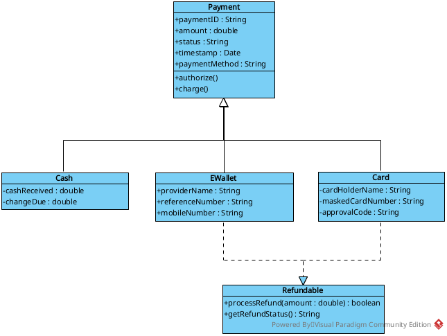
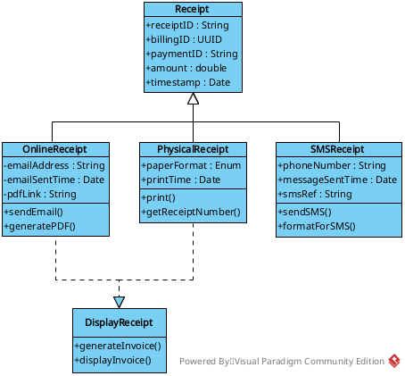
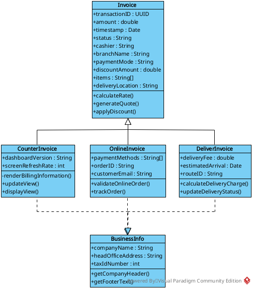
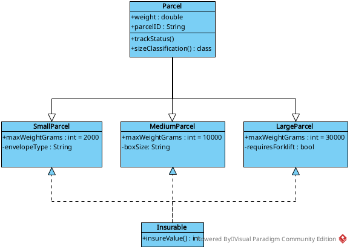
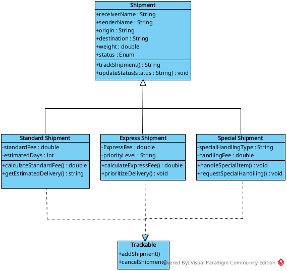
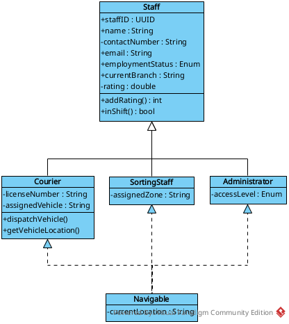
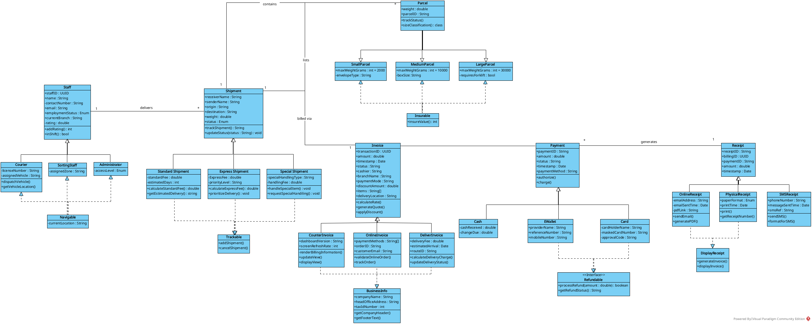

<!-- _backgroundColor: #020c1b -->
<!-- _color: #ffffff -->

# 
System Design Overview

**Technical Architecture & UML Subsystems Presentation**
Based on Object-Oriented Domain Driven Design
Courier & Logistics System

 

**Presented by Group 2-1 (BSCPE - 3C)**
*Francis Benedict Roque, Cyrus Angelo Lopez, John Carlo Santos, Mark Kean Santos*

---

# Agenda

* **Logistics Cycle Graph** — Unified Client & Parcel journey mapping
* **System Design Principles** — Object-Oriented Domain Driven Architecture
* **Subsystems Deep-Dive** — Detailed schemas for the 6 core components

---

# End-to-End Lifecycle: Client & Parcel Journeys

The non-linear, parallel processing lifecycle showing transaction and cargo flows:

  

    

      Client Order Booking
      
Declares weight, size, value

    

  

  

    

      
Financial Path
 
      
Invoice Generated

      
↓

      
Payment Settled

      
↓

      
Receipt Emitted

    

    

      
Cargo Path
 
      
Parcel Sorted (Zone)

      
↓

      
Shipment Assigned

      
↓

      
Courier Geolocation

    

  

  

    

      Final Delivery & Verification
      
Recipient signs & status closes

    

  

---

# Unified Data Pipeline

Data flows through the system domains sequentially during a parcel's lifecycle:

  
Client <small>Initiates</small>

  
➜

  
Parcel <small>Contained in</small>

  
➜

  
Shipment <small>Billed via</small>

  
➜

  
Invoice <small>Settled by</small>

  
➜

  
Payment <small>Generates</small>

  
➜

  
Receipt <small>Proof</small>

<!--
Logistics Trigger: Staff assigns Shipment; Parcel sizing maps to sorting routes.
Financial Trigger: Shipment generates Invoice; Payment clears billing ledger; Receipt is emitted.
-->

---

# Architectural Paradigm

* **Target Paradigm:** Object-Oriented Domain Driven Architecture
* **Structural Division:** Decoupled business domains partition operational, logistical, personnel, and billing systems into clean interfaces and classes.
* **Core Inheritance (Generalization):** Base entities (like `Staff`, `Shipment`, `Parcel`, `Invoice`, `Payment`, `Receipt`) define common logic, specialized by subclasses.
* **Core Contracts (Realization):** Decoupled interfaces (like `Navigable`, `Trackable`, `Insurable`, `BusinessInfo`, `Refundable`, `DisplayReceipt`) guarantee modular behavior.

---

# I. Payment Gateway Subsystem

Processes payment validation, authorization codes, and network settlement.

* `Payment` *(Abstract base)*: Base transaction properties (amount, status, timestamp).
* `Cash`: Local drawer currency accounting.
* `EWallet` *(Refundable)*: Mobile wallet API providers (e.g. Gcash, Paymaya).
* `Card` *(Refundable)*: Credit/Debit card merchant authentication.
* `Refundable` *(Interface)*: Digital channel refund processing contract.

---

# II. Proof of Purchase Subsystem

Generates multi-channel proofs of purchase following gateway settlement.

* `Receipt` *(Abstract base)*: Binds receipt record to invoice and payment details.
* `OnlineReceipt` *(DisplayReceipt)*: Email-dispatched HTML or PDF summaries.
* `PhysicalReceipt` *(DisplayReceipt)*: High-speed thermal paper printer formats.
* `SMSReceipt` *(DisplayReceipt)*: Character-optimized text alerts.
* `DisplayReceipt` *(Interface)*: Layout summaries formatting contract.

---

# III. Financial Auditing Subsystem

Computes base service rates, discounts, cashier details, and business billing headers.

* `Invoice` *(Abstract base)*: Ledger detailing cashier, discounts, and order totals.
* `CounterInvoice` *(BusinessInfo)*: Physical cashiers at retail hubs.
* `OnlineInvoice` *(BusinessInfo)*: Automated customer web order.
* `DeliverInvoice` *(BusinessInfo)*: Route fees for Cash/Pay on Delivery.
* `BusinessInfo` *(Interface)*: Imposes company credentials header.

---

# IV. Physical Cargo Subsystem

Manages physical cargo dimensions, weight thresholds, and insurance limits.

* `Parcel` *(Abstract base)*: Encapsulates weight and unique parcel IDs.
* `SmallParcel` *(Insurable)*: Documents and packages under 2kg.
* `MediumParcel` *(Insurable)*: Boxed cargo under 10kg.
* `LargeParcel` *(Insurable)*: Pallets under 30kg requiring machinery.
* `Insurable` *(Interface)*: Assigns declared coverage valuation.

---

# V. Consignment Transit Subsystem

Governs cargo movement pipelines, delivery speeds, and special configurations.

* `Shipment` *(Abstract base)*: Manages active transit states and tracking records.
* `StandardShipment` *(Trackable)*: Non-urgent, standard pricing lanes.
* `ExpressShipment` *(Trackable)*: Premium priority transit lanes.
* `SpecialShipment` *(Trackable)*: Fragile or hazardous goods handling.
* `Trackable` *(Interface)*: Standardizes customer query updates.

---

# VI. Staff & Personnel Subsystem

Manages employee records, shifts, access control, and routing assignments.

* `Staff` *(Abstract base)*: Encapsulates generic details (name, contact, status, rating).
* `Courier` *(Navigable)*: Field transit personnel tracking vehicles and location.
* `SortingStaff` *(Navigable)*: Hub warehouse operators restricted to sorting zones.
* `Administrator`: Privileged configuration.
* `Navigable` *(Interface)*: Geolocation tracking contract.

---

<!-- _padding: 20px 40px -->

# Unified Class Diagram

<!--
Cross-Domain Association: Integrates financial flow (auditing, invoicing, payments, receipts) and operational logistics (cargo physical dimensions, transit pipelines, personnel routing).
-->

---

<!-- _backgroundColor: #020c1b -->
<!-- _color: #ffffff -->

# Thank You

**Group 2-1 (BSCPE - 3C)**
*Object-Oriented Domain Driven Architecture*

