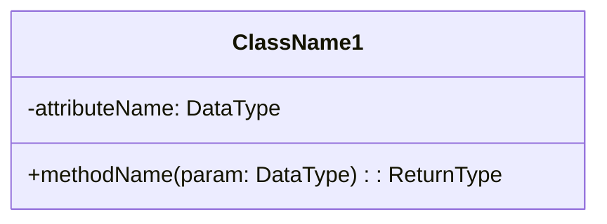
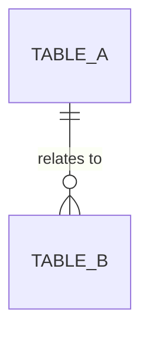
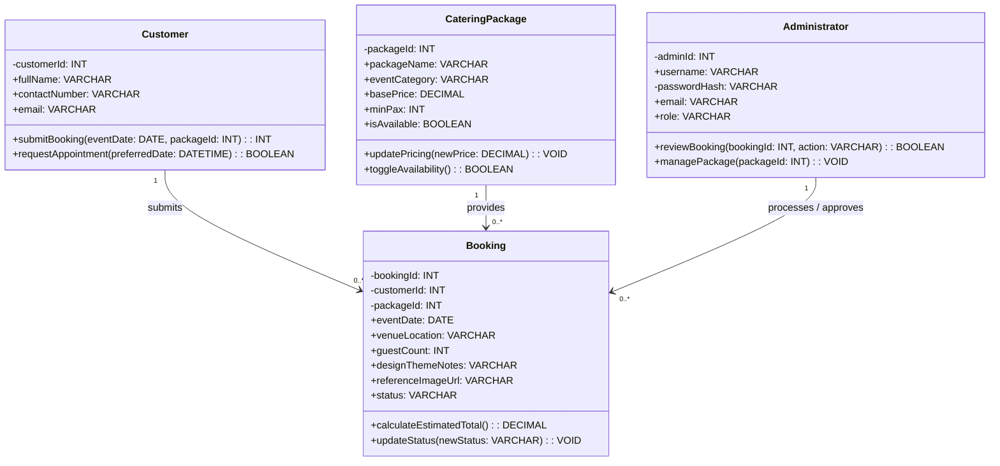
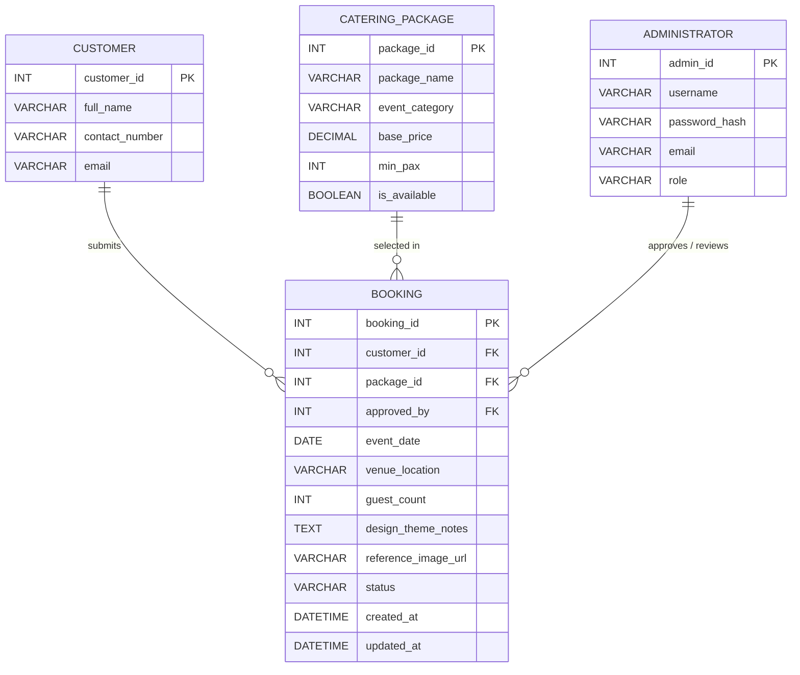

# Midterm Exam: End-to-End System Engineering
**Course:** CPE 304L – Software Design (Laboratory)  
**Institution:** Bulacan State University – College of Engineering (Computer Engineering Department)

---

## Section I: Standard Assessment Template & Framework

### 1. Blank System Engineering Blueprint (Template)

```markdown
# [INSTITUTION / DEPARTMENT NAME]
## [COURSE CODE & TITLE]
### Midterm Assessment: End-to-End System Engineering

**Student Name:** ____________________  
**Score:** ______ / 100  
**Date:** ____________________  
**Course / Year / Section:** ____________________  
**Assigned System Title:** ____________________  

---

## Phase 1: Requirements Engineering (Mini-SRS)

### 1. Problem Discovery (5 Whys Root Cause Analysis)
* **Observed Symptom:** [State the observable, frontline operational failure]
* **Why #1:** [Immediate proximate reason]
* **Why #2:** [Process or visibility breakdown]
* **Why #3:** [Tooling or informational deficit]
* **Why #4:** [Underlying procedural or structural gap]
* **Fundamental Root Cause:** [Structural or system-level architectural absence]

### 2. Standardized Problem Statement
> **[User Persona]** needs a way to **[Action / Specific Goal]** because **[Root Cause / Structural Breakdown]**, resulting in **[Impact / Failure Mode]**.

### 3. Scope Boundaries
* **Inclusions (In-Scope):**
  * [Key MVP capability 1]
  * [Key MVP capability 2]
  * [Key MVP capability 3]
* **Exclusions (Out-of-Scope):**
  * [Deferred feature / External domain boundary 1]
  * [Deferred feature / External domain boundary 2]

### 4. User Classes
1. **[User Class 1 (e.g., Customer/Client)]**: [Specific responsibilities, access boundaries, and interactions]
2. **[User Class 2 (e.g., Administrator/Staff)]**: [Specific administrative or approval responsibilities and permissions]

### 5. Minimum Viable Product (MVP) Requirements
* **Functional Requirements (FRs):**
  * **FR-001:** The system shall [Action/Behavior].
  * **FR-002:** The system shall [Action/Behavior].
  * **FR-003:** The system shall [Action/Behavior].
  * **FR-004:** The system shall [Action/Behavior].
* **Non-Functional Requirements (NFRs):**
  * **NFR-001 ([Quality Attribute, e.g., Security]):** The system shall [Quantifiable / testable constraint].
  * **NFR-002 ([Quality Attribute, e.g., Performance / Availability]):** The system shall [Quantifiable metric, threshold, or uptime target].

---

## Phase 2: Structural Modeling (UML Class Diagram)

### 1. Class Specifications (Minimum 4 Key Classes)
* **`ClassName1`**: [Description]. Attributes: `+attr1: Type`, `-attr2: Type`. Methods: `+method1(): ReturnType`.
* **`ClassName2`**: [Description]. Attributes: `+attr1: Type`, `-attr2: Type`. Methods: `+method1(): ReturnType`.
* **`ClassName3`**: [Description]. Attributes: `+attr1: Type`, `-attr2: Type`. Methods: `+method1(): ReturnType`.
* **`ClassName4`**: [Description]. Attributes: `+attr1: Type`, `-attr2: Type`. Methods: `+method1(): ReturnType`.

### 2. Structural Relationships & Multiplicity
* `ClassName1 [1] ---- <association_verb> ----> [0..*] ClassName2`
* `ClassName2 [0..*] <---- <association_verb> ---- [1] ClassName3`
* `ClassName4 [1] ---- <association_verb> ----> [0..*] ClassName2`

### 3. UML Class Diagram (Mermaid)


### 4. Logic Justification
> *[2-3 sentences explaining how this class structure and its constraints programmatically resolve the 5 Whys root cause and eliminate the symptom.]*

---

## Phase 3: Database Engineering & Data Modeling

### 1. Data Dictionary Matrix
| Table Name | Column Name | Data Type | Key Type | Validation / Constraints |
| :--- | :--- | :--- | :--- | :--- |
| `table_name` | `id` | `INT` | PK | `AUTO_INCREMENT` |
| `table_name` | `attribute_name` | `VARCHAR(100)` | None | `NOT NULL` |

### 2. Logical Schema Relations & Cardinality (Crow's Foot Translation)
* `TABLE_A (PK: id) ||--------------|{ TABLE_B (FK: table_a_id)`
* **Business Rules:** [State 1-to-many, optionality, and referential constraints]

### 3. Entity-Relationship Diagram (ERD - Crow's Foot Notation)

```

---

### 2. Assignable Mini-Systems & Symptom Catalog (Sample Problems)

1. **Task Reminder System**
   * **Stakeholder Symptom:** Users report missing high-priority deadlines despite receiving regular system notifications.
   * **System Scenario:** The system broadcasts automated notifications for all tasks at identical decibel and vibration volumes, leading to notification fatigue.
2. **Attendance Monitoring System**
   * **Stakeholder Symptom:** Course instructors report that manual roll calls waste 15% of total class lecture time.
   * **System Scenario:** In a 60-minute session, passing around a paper attendance sheet and manually transcribing names consumes 10 minutes with illegible handwriting.
3. **Student Consultation Scheduler**
   * **Stakeholder Symptom:** Students regularly travel to campus only to find that their instructor is unavailable.
   * **System Scenario:** Students schedule consultation times on a static physical board, but professors get pulled into unscheduled department meetings with zero synchronization.
4. **Visitor Log Management System**
   * **Stakeholder Symptom:** Facility security guards cannot verify the real-time headcount of external visitors inside the building.
   * **System Scenario:** Visitors sign a paper logbook at entry but bypass signing out on exit, creating a safety hazard during emergencies.
5. **Meeting Room Reservation System**
   * **Stakeholder Symptom:** Student organizations constantly experience scheduling conflicts and arguments over room usage.
   * **System Scenario:** A physical paper calendar taped to the room door is frequently overwritten or erased with pencil.
6. **Personal Budget Manager**
   * **Stakeholder Symptom:** Users report feeling consistently cash-strapped at month-end without understanding where their funds went.
   * **System Scenario:** The system records total monthly expenditures as raw numeric data without category tagging or analysis.
7. **Inventory Monitoring System**
   * **Stakeholder Symptom:** Core administrative office supplies deplete fully before replacements are ordered.
   * **System Scenario:** Physical inventory is checked only on Friday afternoons; Monday stockouts stall operations for days.
8. **Student Portfolio Management System**
   * **Stakeholder Symptom:** Senior students lose critical academic projects permanently due to local drive crashes or theft.
   * **System Scenario:** No central repository exists; students save unversioned files locally on flash drives or personal laptops.
9. **Lost & Found Management System**
   * **Stakeholder Symptom:** 90% of retrieved items are never claimed by owners and are eventually discarded.
   * **System Scenario:** Found items remain locked inside a security office; students cannot browse item descriptions remotely.
10. **Concert Event Ticketing System**
    * **Stakeholder Symptom:** Widespread ticket scalping, bot manipulation, and identity fraud bypass gate security.
    * **System Scenario:** High wireless network congestion prevents real-time online validation, enabling duplicate static ticket passes.

---

## Section II: Client Counterpart Specification
### Client: Casa de Stella Catering Services / Stella's Event Management Services

---

### PHASE 1: REQUIREMENTS ENGINEERING (MINI-SRS)

#### 1. Problem Discovery (5 Whys Root Cause Analysis)
* **Symptom:** Customers experience long delays, pricing confusion, and booking errors when inquiring about catering packages and scheduling event reservations.
* **Why 1:** Business staff must manually respond to repeated phone calls, walk-in consultations, and social media direct messages to share menus and verify schedule availability.
* **Why 2:** Catering package specifications, menu item breakdowns, custom styling portfolios, and open dates are not accessible on any unified digital channel.
* **Why 3:** The business operates without a centralized, self-service online catalog and reservation coordination platform.
* **Why 4:** Booking intake, consultation scheduling, and custom theme request logging are performed manually across physical paper notes and decentralized chat logs.
* **Fundamental Root Cause:** The absence of an integrated, web-based catering package showcase and booking intake system causes customer drop-off, manual intake bottlenecks, and double-booking risks.

#### 2. Standardized Problem Statement
> **Prospective Catering Clients** need a **centralized, self-service booking and package customization platform** because **manual consultation channels and paper-based tracking create communication delays, pricing ambiguity, and reservation scheduling conflicts.**

#### 3. Scope Boundaries
* **Inclusions (In-Scope):**
  1. Digital package and menu catalog browsing with transparent pricing and event categorization.
  2. Public booking request intake with event metadata (date, venue, headcount, theme description, and optional inspiration image attachment).
  3. Appointment scheduling for consultations with conflict validation (`Pending`, `Confirmed`, `Declined`).
  4. Role-based administrative dashboard for managing package availability, approving bookings, and reviewing design submissions.
* **Exclusions (Out-of-Scope):**
  1. Real-time kitchen inventory / raw ingredient depletion tracking.
  2. Direct gateway payment processing and automated invoicing (reserved for Phase 2 future enhancements).
  3. Physical staff dispatching and vehicle fleet telematics.

#### 4. User Classes
* **Guest / Customer:** Unauthenticated prospective client who browses catering packages, selects menus, inputs event details, uploads design references, and submits booking or consultation requests.
* **System Administrator / Events Manager:** Authenticated internal staff member who updates catering menus/pricing, reviews submitted design assets, approves or reschedules appointments, and transitions booking lifecycles.

#### 5. Minimum Viable Product (MVP) Requirements
* **Functional Requirements (FRs):**
  * **FR-001:** The system shall allow unauthenticated customers to browse catering packages filtered by event category (e.g., Wedding, Birthday, Corporate) and view itemized menu inclusions.
  * **FR-002:** The system shall validate and submit customer booking requests requiring event date, venue location, estimated guest count, package ID, and optional design reference image URLs without requiring user registration.
  * **FR-003:** The system shall automatically reject appointment scheduling requests if the requested event date/time slot is already booked or falls within a 7-day minimum lead time buffer.
  * **FR-004:** The system shall provide an administrative dashboard allowing authorized personnel to update package pricing and modify booking status (`Pending`, `Confirmed`, `Declined`, `Completed`).
* **Non-Functional Requirements (NFRs):**
  * **NFR-001 (Performance & Responsiveness):** The customer-facing catalog and booking form shall achieve an initial page load time of under 3.0 seconds over standard 4G mobile broadband connections with up to 100 concurrent sessions.
  * **NFR-002 (Availability & Data Integrity):** The platform shall maintain a minimum monthly uptime of 99.9%, enforcing TLS 1.3 encryption across all client submission forms and storage endpoints.

---

### PHASE 2: STRUCTURAL MODELING (UML CLASS DIAGRAM)

#### 1. Class Specifications
* **`Customer`**: Represents the unauthenticated client submitting inquiries.
  * *Attributes:* `-customerId: INT`, `+fullName: VARCHAR`, `+contactNumber: VARCHAR`, `+email: VARCHAR`
  * *Methods:* `+submitBooking(eventDate: DATE, packageId: INT): INT`, `+requestAppointment(preferredDate: DATETIME): BOOLEAN`
* **`CateringPackage`**: Catalog entry defining catering tiers and menu structures.
  * *Attributes:* `-packageId: INT`, `+packageName: VARCHAR`, `+eventCategory: VARCHAR`, `+basePrice: DECIMAL`, `+minPax: INT`, `+isAvailable: BOOLEAN`
  * *Methods:* `+updatePricing(newPrice: DECIMAL): VOID`, `+toggleAvailability(): BOOLEAN`
* **`Booking`**: Core transaction record binding customer request, package, and event logistics.
  * *Attributes:* `-bookingId: INT`, `-customerId: INT`, `-packageId: INT`, `+eventDate: DATE`, `+venueLocation: VARCHAR`, `+guestCount: INT`, `+designThemeNotes: VARCHAR`, `+referenceImageUrl: VARCHAR`, `+status: VARCHAR`
  * *Methods:* `+calculateEstimatedTotal(): DECIMAL`, `+updateStatus(newStatus: VARCHAR): VOID`
* **`Administrator`**: Privileged staff role with administrative authority.
  * *Attributes:* `-adminId: INT`, `+username: VARCHAR`, `-passwordHash: VARCHAR`, `+email: VARCHAR`, `+role: VARCHAR`
  * *Methods:* `+reviewBooking(bookingId: INT, action: VARCHAR): BOOLEAN`, `+managePackage(packageId: INT): VOID`

#### 2. Structural Relationships & Multiplicity
* `Customer [1] ---------- submits -----------> [0..*] Booking`
* `CateringPackage [1] --- included_in --------> [0..*] Booking`
* `Administrator [1] ----- manages / reviews --> [0..*] Booking`

#### 3. UML Class Diagram



#### 4. Structural Logic Justification
> *The `Booking` aggregate decoupled from strict account authentication allows frictionless customer submissions while strictly binding mandatory foreign keys to a validated `CateringPackage` and `Customer` record. Encapsulating state transitions within the `Administrator` review method guarantees that booking confirmations and pricing calculations cannot be tampered with by external clients, resolving manual scheduling and pricing errors.*

---

### PHASE 3: DATABASE ENGINEERING & DATA MODELING

#### 1. Data Dictionary Matrix

| Table Name | Column Name | Data Type | Key Type | Validation / Constraints |
| :--- | :--- | :--- | :--- | :--- |
| **`customer`** | `customer_id` | `INT` | PK | `AUTO_INCREMENT` |
| | `full_name` | `VARCHAR(120)` | None | `NOT NULL` |
| | `contact_number` | `VARCHAR(20)` | None | `NOT NULL` |
| | `email` | `VARCHAR(100)` | None | `NOT NULL` |
| **`catering_package`** | `package_id` | `INT` | PK | `AUTO_INCREMENT` |
| | `package_name` | `VARCHAR(100)` | None | `NOT NULL, UNIQUE` |
| | `event_category` | `VARCHAR(50)` | None | `NOT NULL, CHECK (event_category IN ('Wedding', 'Debut', 'Birthday', 'Corporate', 'Special Event'))` |
| | `base_price` | `DECIMAL(10,2)`| None | `NOT NULL, CHECK (base_price > 0.00)` |
| | `min_pax` | `INT` | None | `NOT NULL, CHECK (min_pax >= 30)` |
| | `is_available` | `BOOLEAN` | None | `NOT NULL, DEFAULT TRUE` |
| **`administrator`** | `admin_id` | `INT` | PK | `AUTO_INCREMENT` |
| | `username` | `VARCHAR(50)` | None | `NOT NULL, UNIQUE` |
| | `password_hash` | `VARCHAR(255)` | None | `NOT NULL` |
| | `email` | `VARCHAR(100)` | None | `NOT NULL, UNIQUE` |
| | `role` | `VARCHAR(30)` | None | `NOT NULL, CHECK (role IN ('Owner', 'Events_Manager', 'Site_Admin'))` |
| **`booking`** | `booking_id` | `INT` | PK | `AUTO_INCREMENT` |
| | `customer_id` | `INT` | FK | `NOT NULL, REFERENCES customer(customer_id) ON DELETE RESTRICT` |
| | `package_id` | `INT` | FK | `NOT NULL, REFERENCES catering_package(package_id) ON DELETE RESTRICT` |
| | `approved_by` | `INT` | FK | `REFERENCES administrator(admin_id) ON DELETE SET NULL, NULL` |
| | `event_date` | `DATE` | None | `NOT NULL` |
| | `venue_location`| `VARCHAR(255)` | None | `NOT NULL` |
| | `guest_count` | `INT` | None | `NOT NULL, CHECK (guest_count >= 30)` |
| | `design_theme_notes` | `TEXT` | None | `NULL` |
| | `reference_image_url` | `VARCHAR(500)` | None | `NULL` |
| | `status` | `VARCHAR(20)` | None | `NOT NULL, DEFAULT 'Pending', CHECK (status IN ('Pending', 'Confirmed', 'Declined', 'Completed', 'Cancelled'))` |
| | `created_at` | `DATETIME` | None | `NOT NULL, DEFAULT CURRENT_TIMESTAMP` |
| | `updated_at` | `DATETIME` | None | `NOT NULL, DEFAULT CURRENT_TIMESTAMP ON UPDATE CURRENT_TIMESTAMP` |

#### 2. Logical Schema Relations & Cardinality (Crow's Foot Translation)
* `CUSTOMER (PK: customer_id) ||--------------|{ BOOKING (FK: customer_id)`
  * *One customer may submit zero or multiple catering booking requests; each booking must belong to exactly one customer.*
* `CATERING_PACKAGE (PK: package_id) ||--------------|{ BOOKING (FK: package_id)`
  * *One catering package can be selected in zero or many bookings; every booking must reference exactly one package.*
* `ADMINISTRATOR (PK: admin_id) ||--------------o{ BOOKING (FK: approved_by)`
  * *One administrator may approve or process zero or many bookings; a booking's `approved_by` field is optional (`NULL`) until reviewed.*

#### 3. Entity-Relationship Diagram (ERD)


