# System Design Document: End-to-End Data Flow in a CLMS

## I. Project Architecture Overview
**System Name:** GroupX_CourierSystem  
**Target Paradigm:** Object-Oriented Domain Driven Architecture  

### Technical Summary
The Courier and Logistics Management System (CLMS) is an enterprise-grade software architecture designed to streamline end-to-end parcel delivery, financial auditing, and human resource tracking. The system partitions enterprise operations into distinct, highly specialized modules:

1. **Operations & Logistics:** Handles physical asset routing via `Shipment` status pipelines and structural dimensional constraints under the `Parcel` domain.
2. **Infrastructure & Personnel:** Manages administrative, warehouse, and courier staff workflows under the `Staff` framework.
3. **Financial Lifecycle:** Controls billing, transaction settlement, and multichannel proof-of-purchase dispatching across the `Invoice`, `Payment`, and `Receipt` domains.

By utilizing core object-oriented principles such as inheritance (Generalization) to specialize entities and decoupled service contracts (Interfaces) to enforce uniform behavioral rules, the platform guarantees highly scalable data mutations and consistent tracking states across all functional boundaries.

---

## II. Unified System Architecture (High-Level Data Pipeline)
This view maps out how data flows through the core system domains during a parcel's transactional lifecycle—from courier assignment through package sorting, up to invoicing, payment clearing, and multi-channel receipt dispatching.

```mermaid
classDiagram
    direction LR
    
    class Staff {
        <<Abstract>>
        Description: General employee record managing access control and routing assignments.
    }
    class Shipment {
        <<Abstract>>
        Description: Core delivery context managing transit states and operational routing log.
    }
    class Parcel {
        <<Abstract>>
        Description: Physical cargo entity defining weight limits, size rules, and sortation metrics.
    }
    class Invoice {
        <<Abstract>>
        Description: Commercial transactional ledger mapping calculated service fees.
    }
    class Payment {
        <<Abstract>>
        Description: Clearing entity managing payment authentication and invoice settlement status.
    }
    class Receipt {
        <<Abstract>>
        Description: Multi-channel proof of purchase emitted following financial settlement.
    }

    Staff "1" --> "*" Shipment : delivers
    Parcel "*" --> "1" Shipment : contains
    Shipment "1" --> "1" Invoice : billed via
    Invoice "1" --> "1" Payment : settled by
    Payment "1" --> "1" Receipt : generates

```

---

## III. Detailed Subsystem Schemas

### 1. Staff & Personnel Subsystem

**Description:** Manages internal human resources, access levels, authentication paradigms, and tracking metadata for operational personnel.

```mermaid
classDiagram
    direction BT
    
    class Staff {
        +UUID staffID
        +String name
        +String contactNumber
        +String email
        +Enum employmentStatus
        +String currentBranch
        +double rating
        +addRating() int
        +inShift() bool
    }
    note for Staff "Generalized base class representing all internal human resources within the logistics network. It encapsulates common identity, contact, and employment data inherited by all specialized personnel roles, streamlining payroll, access control, and performance reviews."
    
    class Courier {
        -String licenseNumber
        -String assignedVehicle
        +dispatchVehicle()
        +getVehicleLocation()
    }
    note for Courier "A specialized subclass of Staff representing personnel responsible for the physical transit of parcels. It tracks operational field metrics like driver's licensing, vehicle assignments, and real-time transit telemetry."
    
    class SortingStaff {
        -String assignedZone
    }
    note for SortingStaff "A specialized subclass of Staff representing hub-based warehouse operators. It manages local parcel processing tasks, restricting personnel operations to designated physical zones or inventory bins."
    
    class Administrator {
        -Enum accessLevel
    }
    note for Administrator "A specialized subclass of Staff representing personnel with system-wide configuration and security privileges. It manages system overrides, role provisioning, and critical business parameters."
    
    class Navigable {
        <<Interface>>
        -String currentLocation
    }
    note for Navigable "A behavioral contract requiring any implementing class to track and expose geographic coordinates. This ensures real-time tracking across diverse field actors and hardware."

    Courier --|> Staff
    SortingStaff --|> Staff
    Administrator --|> Staff
    
    Courier ..|> Navigable
    SortingStaff ..|> Navigable
    Administrator ..|> Navigable

```

### 2. Consignment Transit Subsystem (Shipments)

**Description:** Governs core cargo movement pipelines, delivery speeds, and priority processing tiers.

```mermaid
classDiagram
    direction BT
    
    class Shipment {
        +trackShipment() String
        +updateStatus(String status) void
    }
    note for Shipment "The central tracking entity governing the operational movement of cargo through the network, managing real-time status transitions and location updates."
    
    class StandardShipment {
        -double standardFee
        -int estimatedDays
        +calculateStandardFee() double
        +getEstimatedDelivery() String
    }
    note for StandardShipment "A specialized consignment class representing non-urgent, standard transit lanes with baseline pricing structures."
    
    class ExpressShipment {
        -double expressFee
        -String priorityLevel
        +calculateExpressFee() double
        +prioritizeDelivery() void
    }
    note for ExpressShipment "A specialized consignment class representing priority transit lanes, featuring tight delivery timelines and premium express rates."
    
    class SpecialShipment {
        -String specialHandlingType
        -double handlingFee
        +handleSpecialItem() void
        +requestSpecialHandling() void
    }
    note for SpecialShipment "A specialized consignment class representing hazardous, fragile, or temperature-controlled goods requiring custom transport configurations."
    
    class Trackable {
        <<Interface>>
        -String senderName
        -String receiverName
        -String origin
        -String destination
        -double weight
        -Enum status
        +addShipment()
        +cancelShipment()
    }
    note for Trackable "An operational service contract ensuring that shipment steps can be queried, updated, and dispatched to end customers for transparent tracking."

    StandardShipment --|> Shipment
    ExpressShipment --|> Shipment
    SpecialShipment --|> Shipment
    
    StandardShipment ..|> Trackable
    ExpressShipment ..|> Trackable
    SpecialShipment ..|> Trackable

```

### 3. Physical Cargo Subsystem (Parcels)

**Description:** Manages the physical constraints, weight categorization, and logistical protection matrices for physical packages.

```mermaid
classDiagram
    direction BT
    
    class Parcel {
        #double weight
        #String parcelID
        +trackStatus()
        +sizeClassification() class
    }
    note for Parcel "A generalized class representing a single cargo item handled by the logistics network. It encapsulates core material dimensions, identification, and tracking states."
    
    class SmallParcel {
        +int maxWeightGrams = 2000
        -String envelopeType
    }
    note for SmallParcel "A specialized parcel subclass optimized for documents, envelopes, and lightweight packets with strict weight limits."
    
    class MediumParcel {
        +int maxWeightGrams = 10000
        -String boxSize
    }
    note for MediumParcel "A specialized parcel subclass optimized for standard boxed cargo, utilizing basic dimensional sorting rules."
    
    class LargeParcel {
        +int maxWeightGrams = 30000
        -bool requiresForklift
    }
    note for LargeParcel "A specialized parcel subclass representing heavy, bulky, or palletized cargo requiring specialized handling machinery, such as forklifts."
    
    class Insurable {
        <<Interface>>
        +insureValue() int
    }
    note for Insurable "A service contract that enables high-value parcels to be assigned declared financial values, enabling premium coverage and automated liability checks."

    SmallParcel --|> Parcel
    MediumParcel --|> Parcel
    LargeParcel --|> Parcel
    
    SmallParcel ..|> Insurable
    MediumParcel ..|> Insurable
    LargeParcel ..|> Insurable

```

### 4. Financial Auditing Subsystem (Invoices)

**Description:** Computes point-of-sale calculations, commercial transactions, billing channels, and corporate metadata layout tracking.

```mermaid
classDiagram
    direction BT
    
    class Invoice {
        +UUID transactionID
        +double amount
        +Date timestamp
        +String status
        +String cashier
        +String branchName
        +String paymentMode
        +double discountAmount
        +String[] items
        +String deliveryLocation
        +calculateRate()
        +generateQuote()
        +applyDiscount()
    }
    note for Invoice "The primary ledger entity representing a detailed commercial statement of services rendered. It computes base rates, applies promotional discounts, and holds the payment status for customer consignments."
    
    class CounterInvoice {
        +String dashboardVersion
        +int screenRefreshRate
        -renderBillingInformation()
        +updateView()
        +displayView()
    }
    note for CounterInvoice "A specialized invoice generated for walk-in clients at physical retail hubs, managed by a physical cashier and requiring local screen rendering properties."
    
    class OnlineInvoice {
        +String[] paymentMethods
        +String orderID
        +String customerEmail
        +validateOnlineOrder()
        +trackOrder()
    }
    note for OnlineInvoice "A specialized invoice generated automatically via web or mobile apps, integrating digital payment mechanisms and tracking links for self-service customers."
    
    class DeliverInvoice {
        +double deliveryFee
        +Date estimatedArrival
        +String routeID
        +calculateDeliveryCharge()
        +updateDeliveryStatus()
    }
    note for DeliverInvoice "A specialized invoice generated specifically for pay-on-delivery or cash-on-delivery (COD) consignments, managing fluctuating delivery rates and transit-based updates."
    
    class BusinessInfo {
        <<Interface>>
        +String companyName
        +String headOfficeAddress
        +int taxIDNumber
        +getCompanyHeader()
        +getFooterText()
    }
    note for BusinessInfo "A structural contract enforcing the presentation of uniform corporate credentials, tax compliance details, and contact headers on any billing document."

    CounterInvoice --|> Invoice
    OnlineInvoice --|> Invoice
    DeliverInvoice --|> Invoice
    
    CounterInvoice ..|> BusinessInfo
    OnlineInvoice ..|> BusinessInfo
    DeliverInvoice ..|> BusinessInfo

```

### 5. Payment Gateway Subsystem

**Description:** Processes multiple transactional mediums and enforces financial settlement rules across payment networks.

```mermaid
classDiagram
    direction BT
    
    class Payment {
        +String paymentID
        +double amount
        +String status
        +Date timestamp
        +String paymentMethod
        +authorize()
        +charge()
    }
    note for Payment "A generalized class representing a financial transaction aimed at settling an invoice. It manages basic authorization statuses, transaction timelines, and transaction IDs."
    
    class Cash {
        -double cashReceived
        -double changeDue
    }
    note for Cash "A specialized payment subclass representing physical cash transactions, managing cash received and exact change calculation."
    
    class EWallet {
        +String providerName
        +String referenceNumber
        +String mobileNumber
    }
    note for EWallet "A specialized digital payment subclass representing mobile wallets, managing API provider names, reference codes, and mobile numbers."
    
    class Card {
        -String cardHolderName
        -String maskedCardNumber
        -String approvalCode
    }
    note for Card "A specialized digital payment subclass representing debit or credit cards, tracking masked card numbers, merchant authorization, and cardholder details."
    
    class Refundable {
        <<Interface>>
        +processRefund(double amount) boolean
        +getRefundStatus() String
    }
    note for Refundable "A transactional interface enforcing refund processing and status checking logic specifically for digital payment channels."

    Cash --|> Payment
    EWallet --|> Payment
    Card --|> Payment
    
    EWallet ..|> Refundable
    Card ..|> Refundable

```

### 6. Proof of Purchase Subsystem (Receipts)

**Description:** Handles formatting specifications and communications layout mapping for modern multichannel consumer receipt rendering.

```mermaid
classDiagram
    direction BT
    
    class Receipt {
        +String receiptID
        +UUID billingID
        +String paymentID
        +double amount
        +Date timestamp
    }
    note for Receipt "A generalized class representing official proof of purchase. It binds a unique receipt record to an invoice and a finalized payment."
    
    class OnlineReceipt {
        -String emailAddress
        -Date emailSentTime
        -String pdfLink
        +sendEmail()
        +generatePDF()
    }
    note for OnlineReceipt "A specialized receipt subclass distributed electronically, tracking target email addresses, dispatch timestamps, and PDF download links."
    
    class PhysicalReceipt {
        +Enum paperFormat
        -Date printTime
        +print()
        +getReceiptNumber()
    }
    note for PhysicalReceipt "A specialized receipt subclass rendered for local printing, tracking physical layout sizing, printer outputs, and paper formatting."
    
    class SMSReceipt {
        +String phoneNumber
        -Date messageSentTime
        +String smsRef
        +sendSMS()
        +formatForSMS()
    }
    note for SMSReceipt "A specialized receipt subclass dispatched via text messaging, managing cellular phone numbers, character-optimized layouts, and SMS gateway references."
    
    class DisplayReceipt {
        <<Interface>>
        +generateReceipt()
        +displayReceipt()
    }
    note for DisplayReceipt "A layout-rendering contract that requires implementing classes to generate formatted, printable, or screen-compatible transaction summaries."

    OnlineReceipt --|> Receipt
    PhysicalReceipt --|> Receipt
    SMSReceipt --|> Receipt
    
    OnlineReceipt ..|> DisplayReceipt
    PhysicalReceipt ..|> DisplayReceipt
    SMSReceipt ..|> DisplayReceipt
```

